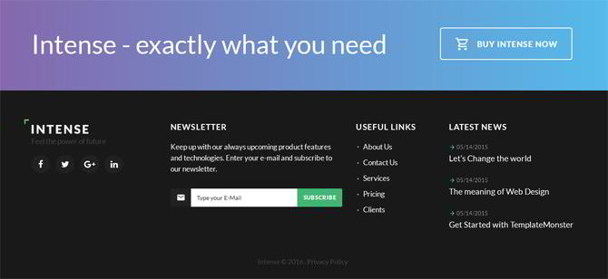

# BootCamp Repository.
  `by José Miguel García García`

 ## Abstract

In this repo you can find the solution for the activities proposed in the astound JS bootcamp.

 ### Homework 1

For this homework you need to develop a footer only with *HTML* & *CSS*, avoid the functionality and focus on the design.

The image above is the expected output. You can use 
preprocessors for this labor.

